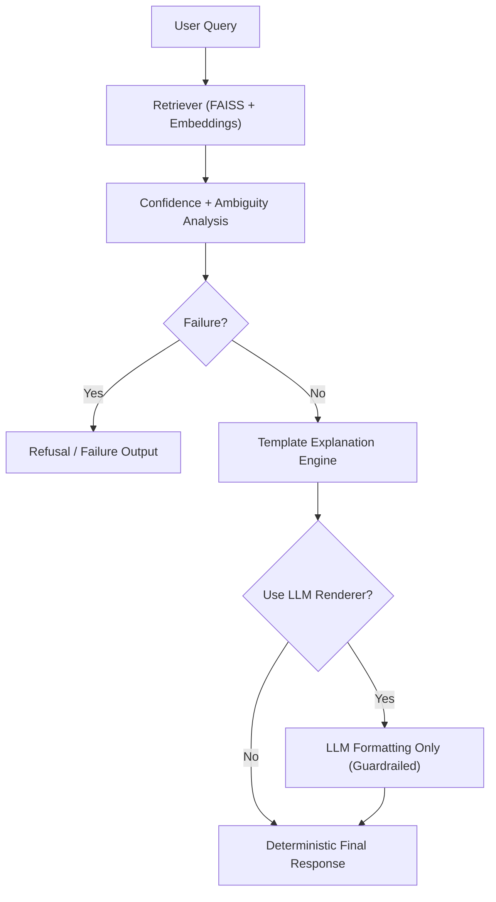

# Phase 1 - Retrieval Engineering and Failure-Aware RAG

> *"If the system is uncertain, refusal is correctness."*

Phase 1 turns the Phase 0 principles into a working AI system.  
The target was not "chatbot behavior." The target was controlled retrieval, grounded responses, explicit uncertainty handling, and measurable safety.

---

## 1. Problem Framing

Pakistan Sign Language (PSL) glosses are often context-sensitive. A single gloss can map to multiple meanings, so naive retrieval can produce overconfident but wrong explanations.

This phase focused on building a local RAG pipeline that:

- Retrieves relevant PSL knowledge from a structured corpus
- Distinguishes direct matches from ambiguous matches
- Refuses when confidence is too low or the query is out-of-domain (OOD)
- Exposes behavior through deterministic output contracts

---

## 2. System Boundary and Architecture

The system was designed with strict component separation:

- Ingestion layer: converts PSL entries into semantically useful chunks
- Embedding layer: generates local vector embeddings
- Retrieval layer: FAISS similarity search and candidate ranking
- Decision layer: confidence scoring + ambiguity detection + failure classification
- Explanation layer: deterministic response templates
- Optional rendering layer: local LLM for wording only (no decision authority)
- API layer: FastAPI as transport shell only

> [!IMPORTANT]
> Inference can suggest content, but final behavior is controlled by deterministic decision logic.

---

## 3. Knowledge Ingestion and Chunking Discipline

The project started with a domain schema for PSL gloss knowledge and converted structured entries into retrieval chunks.

Design goals:

- Preserve linguistic context across chunk boundaries
- Keep chunks small enough for effective semantic search
- Maintain traceability from chunk to original gloss entry

This prevents retrieval quality from collapsing due to poorly structured context.

---

## 4. Embeddings and Retrieval Layer

Core implementation choices:

- Local sentence-transformer embeddings (`all-MiniLM-L6-v2`)
- Local FAISS vector index
- Similarity-based top-k retrieval for PSL queries

This gave low-latency local retrieval without external API dependency.

---

## 5. Confidence, Ambiguity, and Decision Rules

Deterministic confidence heuristics were introduced to prevent unsafe answering:

- Absolute score thresholds
- Score-delta checks between top candidates
- Candidate-agreement checks across retrieved chunks

### Confidence Policy

| Level | Score Range | Behavior |
| :--- | :--- | :--- |
| HIGH | `< 0.9` | Direct answer |
| MEDIUM | `0.9 - 1.4` | Tentative answer with caveats |
| LOW | `> 1.4` | Refusal |

### Ambiguity Policy

- Within-gloss ambiguity: one gloss has multiple valid meanings
- Across-result ambiguity: multiple glosses compete with similar confidence

Ambiguity is exposed explicitly instead of being silently guessed away.

---

## 6. Failure Taxonomy and Safety Contract

Failure was treated as a first-class output, not an exception path.

Implemented taxonomy included:

- `POOR_QUALITY`
- `COLLISION`
- `NO_MATCHES`

Safety contract:

- Failure checks run before explanation generation
- Terminal failures bypass LLM rendering completely
- System returns refusal/ambiguity outputs instead of fabricated certainty

> [!CAUTION]
> A wrong confident answer is more harmful than a refusal in uncertainty-heavy domains.

---

## 7. API Packaging Without Domain Leakage

FastAPI was added as a minimal transport interface:

- `POST /query`
- Request: `{"query": "string"}`
- Response is exactly one of:
  - `{"answer": "..."}`
  - `{"ambiguity": {"candidates": [...]}}`
  - `{"refusal": "..."}`

Pydantic validators enforce the "exactly-one-of" response rule so output contracts stay stable.

---

## 8. Evaluation and Measurable Outcomes

A focused gold set was used to measure behavior across direct, ambiguous, near-collision, and OOD queries.

Reported results:

- Top-1 retrieval accuracy: `66.7%`
- Ambiguity detection accuracy: `100%`
- OOD rejection rate: `100%`
- False confident answers: `0`

Key conclusion:

- In this phase, safe refusal and correct ambiguity signaling were prioritized over aggressive answer coverage.

---

## 9. Engineering Lessons from Phase 1

- RAG quality is mostly a retrieval and decision-boundary problem, not a prompting problem.
- Deterministic wrappers make probabilistic components auditable.
- Confidence must be operationalized as behavior, not just logged as a score.
- Small, high-quality eval sets are useful when the goal is failure safety.
- API contracts should expose uncertainty states explicitly.

---

## 10. References

- [PSL-ExplainRAG_V1 Repository](https://github.com/MohibUllahKhanSherwani/PSL-ExplainRAG_V1)
- [LangChain Documentation](https://python.langchain.com/docs/introduction/)
- [FAISS Documentation](https://faiss.ai/)
- [FastAPI Documentation](https://fastapi.tiangolo.com/)
- [Sentence-Transformers Documentation](https://www.sbert.net/)

