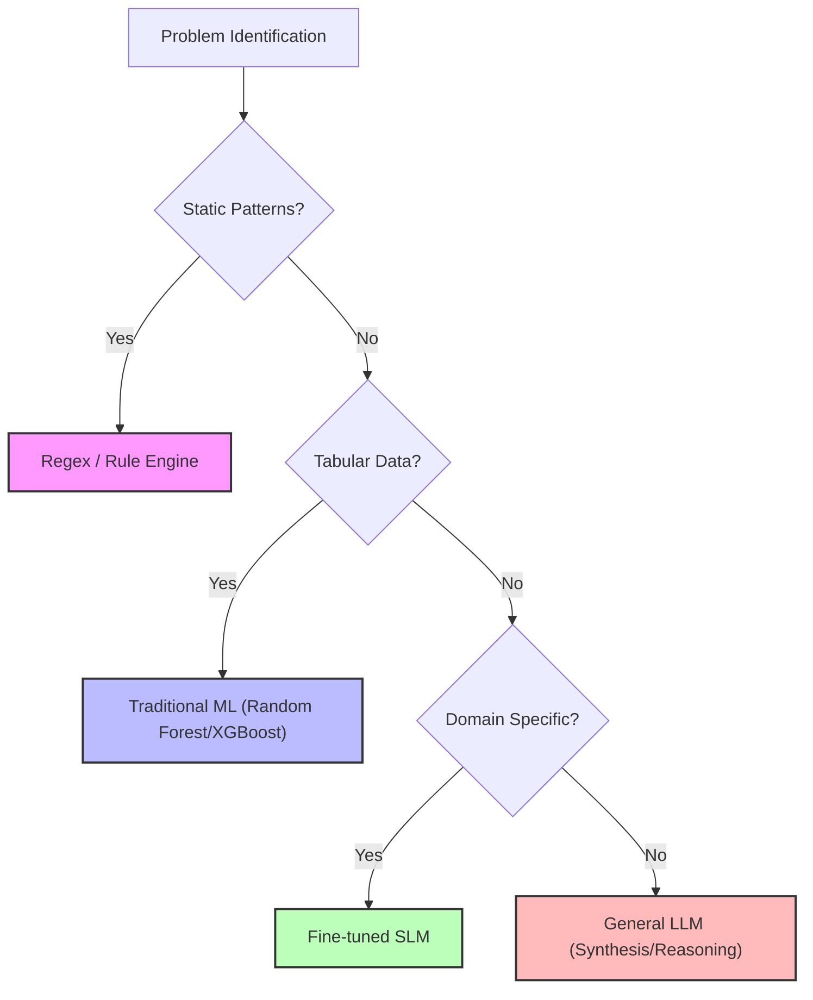

# 🎯 Phase 0 — Systems Mindset & LLM Skepticism

> *"If a deterministic solution exists, the LLM is disqualified."*

Phase 0 is not about tools. It is about **intellectual discipline**. Before building AI systems, you must understand the boundaries between deterministic guarantees and probabilistic risks.

---

## 1️⃣ Deterministic vs. Probabilistic Systems

Understanding the core difference between these two paradigms is the first step in robust AI engineering.

| Feature | Deterministic Systems | Probabilistic Systems (LLMs) |
| :--- | :--- | :--- |
| **Logic** | Same input → same output | Output sampled from distribution |
| **Execution** | Fully traceable path | Implicit reasoning path |
| **Failures** | Reproducible | Non-reproducible (at Temp > 0) |
| **Examples** | SQL, Regex, Rule Engines | GPT-4, Claude, Llama |
| **Correctness** | Binary (True/False) | "Most likely" (Confidence ≠ Correctness) |

---

## 2️⃣ Control Flow vs. Inference

*   **Control Flow:** Explicit branching via `if/else`, state machines, and API contracts.
*   **Inference:** Implicit decisions via classification, generation, or embedding similarity.

> [!IMPORTANT]
> **The Cardinal Architectural Rule:**
> **Inference must NEVER replace control flow.**

*   **Allowed:** LLM suggests a classification → output is validated → mapped to an internal Enum.
*   **Forbidden:** LLM directly deciding the business logic execution path or calling functions without a deterministic middle layer.

---

## 3️⃣ Strategic Skepticism — Reliability Rules

### 🛡️ Deterministic Wrappers
*   No raw LLM output touches core logic.
*   Enforce **Pydantic / JSON schema** validation.
*   Reject malformed output and version prompts as code.
*   Fail loudly if validation fails.

### 🚩 Explicit Failure > Silent Hallucination
*   A "refusal" or an error is infinitely better than a wrong answer.
*   Include a **refusal path** and a **fallback path** for every probabilistic endpoint.
*   Empty retrieval → bypass generation.

### ⚖️ Calibration Awareness
*   LLMs are often overconfident in ambiguous tasks.
*   Treat high-confidence scores in open-ended tasks as suspicious.
*   Add verification layers for high-risk outputs.

### 🔍 The Opacity Trap
*   No abstraction without visibility. Glass-box > Black-box.
*   Log all raw prompts and responses for auditability.
*   Intercept API calls if necessary.

---

## 4️⃣ Tool Selection Discipline

Always attempt lower-complexity solutions first. Use the logic ladder below to decide if an LLM is truly necessary.

### 🪜 Selection Criteria

| Layer | When to Use | Auditability | Latency | Cost |
| :--- | :--- | :--- | :--- | :--- |
| **Regex / Rules** | Static patterns | 100% | Very Low | Minimal |
| **Traditional ML** | Structured data | High | Low | Low |
| **Fine-tuned SLM** | Domain extraction | Moderate | Medium | Medium |
| **General LLM** | Synthesis / Reasoning | Low | High | High |

> [!CAUTION]
> **Hard Rule:** If a deterministic solution works → LLM is forbidden.

---

## 5️⃣ Black-Box vs. Glass-Box Systems

Enterprise maturity means: **“We know why it works.”**

*   **Log every prompt and response:** Ensure full traceability of the inference path.
*   **Version-control every prompt:** Treat prompts as code, not configuration.
*   **Measure latency + token cost:** Track these metrics per request.
*   **Maintain evaluation datasets (Evals):** Continuous testing against known ground truths.
*   **No invisible reasoning:** Avoid hidden chain-of-thought that isn't logged or auditable.

---

## 6️⃣ Cost, Latency & Reliability

LLM systems behave like distributed systems and must follow those engineering rigors.

### A. Timeouts, Retries, and Backoff
*   Always use **exponential backoff with jitter** to avoid retry storms.
*   Timeouts must be deliberate and strictly enforced.
*   Retries are only safe for **idempotent** operations.

### B. Idempotency
*   Every mutating endpoint must support **idempotency keys**.
*   Duplicate execution must not create duplicate effects (e.g., double billing).
*   Response caching should utilize a request hash for consistency.

### C. Tail Latency
Don't optimize for the average; track the **p95/p99**.
*   The system must enforce time budgets and provide a fallback when the model hangs.

---

## 7️⃣ When NOT to Use an LLM

An LLM is objectively the wrong tool for:
*   **Deterministic extraction** with static patterns.
*   **Numeric regression** on tabular data.
*   **Regulatory classification** requiring a 1:1 audit trail.
*   **High-frequency, low-latency microservices** (<20ms).
*   **Replacement** for SQL, CASE statements, Random Forest, or rule engines.

---

## 📚 Sources Studied

### 🔗 When NOT to Use an LLM
*   [When Not to Use LLMs](https://www.latent.space/p/when-not-to-use-llms) – *Latent Space*
*   [Prompt Engineering vs. Reliability Limits](https://hamel.dev/blog/posts/prompt/) – *Hamel Husain*
*   [Language Models Mostly Know What They Know](https://www.anthropic.com/research/language-models-mostly-know-what-they-know) – *Anthropic Research*

### 🔗 Rule-Based → ML → LLM
*   [LLM Patterns & Decision Trees](https://eugeneyan.com/writing/llm-patterns/) – *Eugene Yan*
*   [Enterprise AI: The Reality of Integration](https://martinfowler.com/articles/enterpriseAI.html) – *Martin Fowler*

### 🔗 Systems Reliability (AWS/Stripe)
*   [Timeouts, Retries, and Backoff with Jitter](https://aws.amazon.com/builders-library/timeouts-retries-and-backoff-with-jitter/)
*   [Making Retries Safe with Idempotent APIs](https://aws.amazon.com/builders-library/making-retries-safe-with-idempotent-APIs/)
*   [Idempotency: Avoiding Double-Action](https://stripe.com/blog/idempotency)
