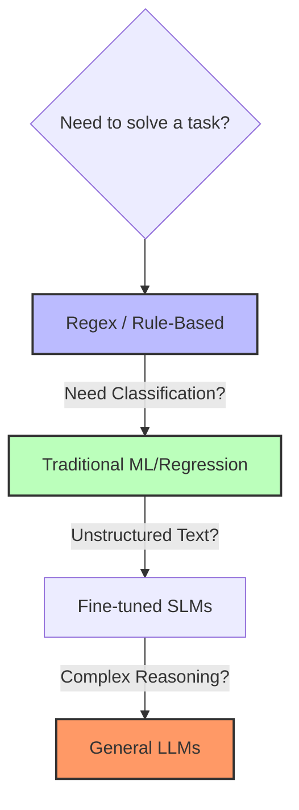
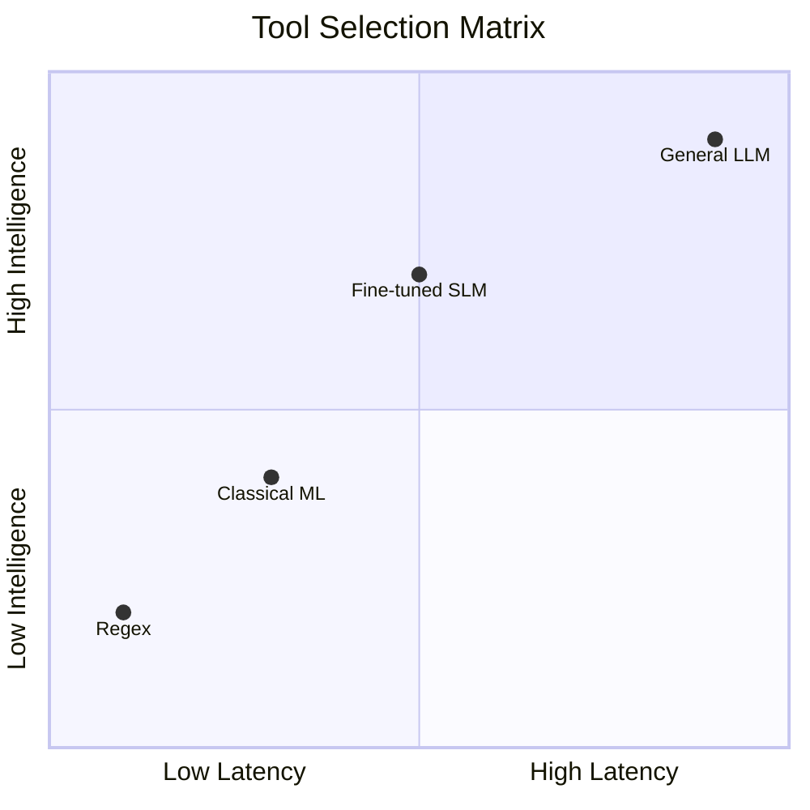

# 🎯 Phase 0: The Foundations of LLM Skepticism

> **"The first rule of AI Engineering is to avoid using an LLM if a deterministic solution exists."**

Phase 0 focuses on the boundaries of Large Language Models and the transition from heuristic-based logic to probabilistic systems. Before building, an engineer must know when *not* to build.

---

## 🛠 1. Strategic Skepticism: Rules for Reliability

LLMs are "dodgy collaborators"—capable but inherently unreliable. To build enterprise systems, you must treat them as probabilistic components inside a deterministic harness.

### 📜 Core Engineering Rules
1.  **The Calibration Hack**: Use self-evaluation loops. Ask the model to propose an answer, then ask for the probability that its own answer is correct ($P(\text{True})$).
2.  **Deterministic Wrappers**: Never let raw LLM output touch your core business logic. Wrap outputs in **Pydantic schemas** and **Guardrails** to enforce syntax and factual constraints.
3.  **The Uncertainty Threshold**: Larger models are better calibrated than smaller ones but are prone to **overconfidence** in high-entropy scenarios. If a model is 99% confident but the task is open-ended, verify it.

### Key Failure Modes
*   **The Opacity Trap**: Assuming a library (LangChain/DSPy) is doing magic. **Rule:** *"Fuck you, show me the prompt!"* Use tools like `mitmproxy` to intercept and inspect every raw API call.
*   **Factual Hallucination**: LLMs "mostly know what they know." If the cost of a mistake is infinite, use **Ground Truth** verification or RAG to pin the model to reality.

---

## 🪜 2. The Decision Ladder: Selecting the Right Tool

Choosing the right tool is a balance of **Auditability**, **Latency**, and **Cost**.

### Approach Rules
| Approach | When it Beats LLM | Auditability | Trade-off |
| :--- | :--- | :--- | :--- |
| **Regex/Rules** | When the pattern is static and logic is 100% definable. | **100%** | Ultra-low latency (20ms). |
| **Traditional ML** | For numeric, tabular data and regression tasks. | **High** | Uses SHAP/LIME for feature importance. |
| **Fine-tuned SLMs** | High-volume specific tasks (e.g., entity extraction). | **Moderate** | Medium cost, high throughput. |
| **General LLMs** | Synthesis, complex reasoning, free-form text. | **Low** | Black-box. High latency/cost. |

> [!IMPORTANT]
> **Traditional ML Advantage:** Traditional models are more deterministic and have well-understood failure modes. Use them for regulated financial, medical, or legal classification where **Audit Trails** are mandatory.

---

## 🔍 3. Black-Box vs. Glass-Box Systems

Enterprise maturity is defined by the move from "it works" to "we know exactly why it works."

### The "Glass-Box" Playbook
1.  **Visibility Over Abstraction**: Prioritize seeing the raw prompt over using complex framework abstractions. Minimize *accidental complexity*.
2.  **Context Engineering**: Treat prompts as high-level architectural guides. Keep prompts focused and lean to maintain control over the agent's "reasoning path."
3.  **Measurement Over intuition**: Implement **Evals** (Evaluation Frameworks) to measure system drift. Treat every LLM-generated block like a Code PR that requires a deterministic test pass.

---

> [!TIP]
> **Final Rule:** AI Engineering is as much about **deconstruction** as construction. If it can be done with a `CASE` statement, a `Regex`, or a `Random Forest`, it should be.
