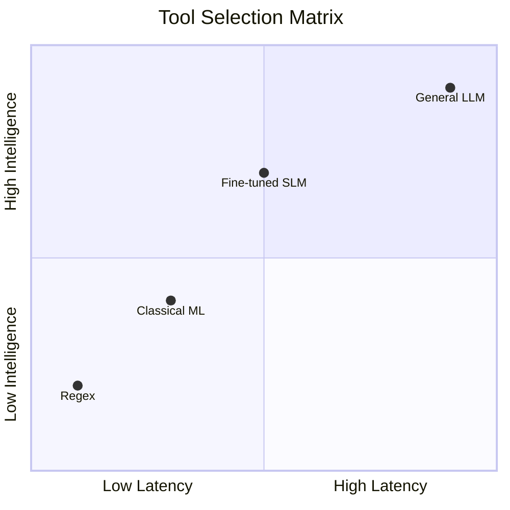

# 🎯 Phase 0 — Systems Mindset & LLM Skepticism

> *"If a deterministic solution exists, the LLM is disqualified."*

Phase 0 is not about tools. It is about **intellectual discipline**. Before building AI systems, you must understand the boundaries between deterministic guarantees and probabilistic risks.

---

## 1️⃣ Deterministic vs. Probabilistic Systems

| Feature | Deterministic Systems | Probabilistic Systems (LLMs) |
| :--- | :--- | :--- |
| **Logic** | Same input → same output | Output sampled from distribution |
| **Execution** | Fully traceable path | Implicit reasoning path |
| **Failures** | Reproducible | Non-reproducible (at Temp > 0) |
| **Examples** | SQL, Regex, Rule Engines | GPT-4, Claude, Llama |
| **Correctness** | Binary (True/False) | "Most likely" (Confidence ≠ Correctness) |

---

## 2️⃣ Control Flow vs. Inference

* **Control Flow:** Explicit branching via `if/else`, state machines, and API contracts.
* **Inference:** Implicit decisions via classification, generation, or embedding similarity.

**The Cardinal Architectural Rule:**
> **Inference must NEVER replace control flow.**

* **Allowed:** LLM suggests a classification → output is validated → mapped to an internal Enum.
* **Forbidden:** LLM directly deciding the business logic execution path or calling functions without a deterministic middle layer.

---

## 3️⃣ Strategic Skepticism — Reliability Rules

1. **Deterministic Wrappers**
   * No raw LLM output touches core logic.
   * Enforce **Pydantic / JSON schema** validation.
   * Reject malformed output and version prompts as code.
   * Fail loudly if validation fails.

2. **Explicit Failure > Silent Hallucination**
   * A "refusal" or an error is infinitely better than a wrong answer.
   * Include a **refusal path** and a **fallback path** for every probabilistic endpoint.
   * Empty retrieval → bypass generation.

3. **Calibration Awareness**
   * LLMs are often overconfident in ambiguous tasks.
   * Treat high-confidence scores in open-ended tasks as suspicious.
   * Add verification layers for high-risk outputs.

4. **The Opacity Trap**
   * No abstraction without visibility. Glass-box > Black-box.
   * Log all raw prompts and responses for auditability.
   * Intercept API calls if necessary.

---

## 4️⃣ The Decision Ladder — Tool Selection Discipline

Always attempt lower-complexity solutions first.

### 4️⃣ Selection Criteria

| Layer | When to Use | Auditability | Latency | Cost |
| :--- | :--- | :--- | :--- | :--- |
| **Regex / Rules** | Static patterns | 100% | Very Low | Minimal |
| **Traditional ML** | Structured data | High | Low | Low |
| **Fine-tuned SLM** | Domain extraction | Moderate | Medium | Medium |
| **General LLM** | Synthesis / Reasoning | Low | High | High |

> **Hard Rule:** If a deterministic solution works → LLM is forbidden.

---

## 5️⃣ Black-Box vs. Glass-Box Systems

Enterprise maturity means: **“We know why it works.”**

* **Log every prompt and response:** Ensure full traceability of the inference path.
* **Version-control every prompt:** Treat prompts as code, not configuration.
* **Measure latency + token cost:** Track these metrics per request to avoid "invisible" overhead.
* **Maintain evaluation datasets (Evals):** Continuous testing against known ground truths.
* **No invisible reasoning:** Avoid hidden chain-of-thought that isn't logged or auditable.

---

## 6️⃣ Cost, Latency & Reliability (Distributed Systems Reality)

LLM systems behave like distributed systems and must follow those engineering rigors.

### A. Timeouts, Retries, and Backoff
Retries amplify load during failure; "retry storms" can collapse a system.
* Always use **exponential backoff with jitter**.
* Timeouts must be deliberate and strictly enforced.
* Retries are only safe for **idempotent** operations.

### B. Idempotency
An operation is repeatable without changing the result or creating side effects.
* Every mutating endpoint must support **idempotency keys**.
* Duplicate execution must not create duplicate effects (e.g., double billing).
* Response caching should utilize a request hash for consistency.

### C. Tail Latency
Don't optimize for the average; track the **95th and 99th percentile (p95/p99)**.
* LLMs have high variance, network dependency, and are prone to throttling.
* The system must enforce time budgets and provide a fallback when the model hangs.

### D. Cost as a First-Class Constraint
Cost scales with tokens, context window size, and unnecessary retries.
* **Design Strategy:** Minimize context, cache embeddings, and avoid unnecessary generation.
* **Tracking:** Monitor cost per request. If a PSL explanation costs **$0.12**, the deployment must justify that specific business value.

---

## 7️⃣ When NOT to Use an LLM

An LLM is objectively the wrong tool for:
* **Deterministic extraction** with static patterns.
* **Numeric regression** on tabular data.
* **Regulatory classification** requiring a 1:1 audit trail.
* **High-frequency, low-latency microservices** (<20ms).
* **Replacement** for SQL, CASE statements, Random Forest, or rule engines.

---

## 8️⃣ Operational Principles

* **Validation is Mandatory:** No LLM output touches the system without schema validation.
* **Fallback Required:** No probabilistic routing without a deterministic fallback.
* **Version Control:** All prompts must be version-controlled like software.
* **Zero-Retrieval Policy:** Empty retrieval results → no generation.
* **Idempotency:** All retries must be idempotent.
* **The Explanability Bar:** If you cannot explain how it fails, you cannot use it.

## 📚 Sources Studied (Phase 0)

### 1️⃣ When NOT to Use an LLM (Critical)
**Focus:** Internalizing failure modes, understanding the overconfidence problem, and why deterministic logic must wrap probabilistic outputs.

* [When Not to Use LLMs](https://www.latent.space/p/when-not-to-use-llms) – *Latent Space*
* [Prompt Engineering vs. Reliability Limits](https://hamel.dev/blog/posts/prompt/) – *Hamel Husain*
* [Language Models Mostly Know What They Know](https://www.anthropic.com/research/language-models-mostly-know-what-they-know) – *Anthropic Research*

---

### 2️⃣ Rule-Based → ML → LLM Decision Ladder
**Focus:** Choosing the right tool for the job. Identifying when regex or classical ML (Random Forest/XGBoost) beats an LLM in cost, latency, and auditability.

* [LLM Patterns & Decision Trees](https://eugeneyan.com/writing/llm-patterns/) – *Eugene Yan*
* [Enterprise AI: The Reality of Integration](https://martinfowler.com/articles/enterpriseAI.html) – *Martin Fowler*
* [LLM vs. Traditional ML: A Comparison](https://www.rudderstack.com/blog/llm-vs-traditional-ml/) – *RudderStack*

---

### 3️⃣ Black-Box vs. Glass-Box Systems
**Focus:** Observability and explainability. Moving beyond "it works" to "we know exactly why it failed."

* [AI-Augmented Development: Control & Visibility](https://martinfowler.com/articles/ai-augmented-development.html) – *Martin Fowler*
* [Sparks of Artificial General Intelligence (Evaluation & Opacity Sections)](https://arxiv.org/abs/2303.12712) – *Microsoft Research (Arxiv)*

---

### 4️⃣ Cost, Latency, Reliability (Systems View)
**Focus:** Essential distributed systems engineering. Treating LLM calls as volatile network requests that require rigorous handling.

* [Timeouts, Retries, and Backoff with Jitter](https://aws.amazon.com/builders-library/timeouts-retries-and-backoff-with-jitter/) – *AWS Builders Library*
* [Making Retries Safe with Idempotent APIs](https://aws.amazon.com/builders-library/making-retries-safe-with-idempotent-APIs/) – *AWS Builders Library*
* [Idempotency: Avoiding Double-Action in Distributed Systems](https://stripe.com/blog/idempotency) – *Stripe Engineering*
